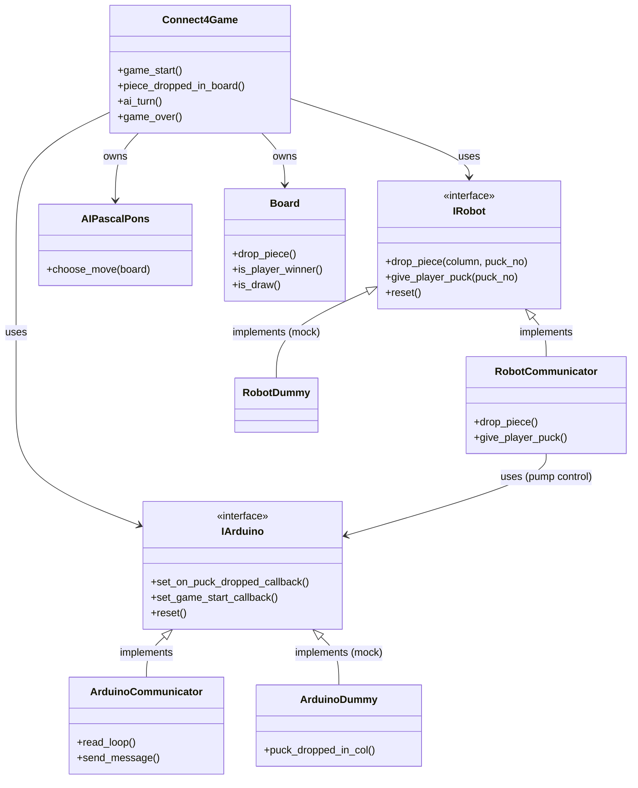

# Connect 4 Robot

A robotic Connect 4 game where a MyCobot 280 robot arm plays against a human player. The system uses drop detection via LED strip photoresistors, automated puck dispensing with solenoids, and [PascalPons's connect 4 solver](https://github.com/PascalPons/connect4) for the AI. 

## Quick Setup
the installation assumes you're using a RaspberryPi for the pc.
1. `chmod +x setup.sh && ./setup.sh`
2. go to `arduino_controller` and burn the code onto an arduino nano.
the rest of the setup (connectors etc.) will be described in the [DRIVE FOLDER](https://madaorgil.sharepoint.com/sites/MakeMada/Shared%20Documents/Forms/AllItems.aspx?id=%2Fsites%2FMakeMada%2FShared%20Documents%2F2%2E%20%D7%AA%D7%A2%D7%A8%D7%95%D7%9B%D7%95%D7%AA%2F%D7%94%D7%97%D7%95%D7%A4%D7%A9%20%D7%9C%D7%99%D7%A6%D7%95%D7%A8%2F2%2E%20%D7%91%D7%99%D7%AA%20%D7%9E%D7%9C%D7%90%D7%9B%D7%94%2F2%2E%20%D7%9E%D7%95%D7%A6%D7%92%D7%99%D7%9D%2Fconnect%204&viewid=b5506206%2Dcce1%2D4963%2D8af9%2D671538374454) under electronics.

## Useful Files:
- `serial_middleman.py` - lets you inject commands to the arduino from the pc and vice versa, for testing.


## System Overview

```
┌───────────────────────────────────┐
│       PC MAIN CONTROLLER          │
│   ┌────────────┬────────────┐     │
│   │   Robot    │   Arduino  │     │
│   │ Interface  │ Interface  │     │
│   └────────────┴────────────┘     │
└─────────────┬──────┬──────────────┘
              │      │
        USB Serial   USB Serial
              │      │
     ┌────────▼─┐ ┌───▼────────────┐
     │  Robot   │ │   Arduino      │
     │  Arm     │ │ - LED Strip    │
     │  (via    │ | - Solenoids    │
     │pymycobot)│ │ - Robot Pump   |
     └──────────┘ └────────────────┘
```

## Architecture

The system consists of three main controllers:

1. **PC Main Controller** - Orchestrates gameplay, runs AI, manages state. Located at connect4_engine.
2. **Arduino Controller** - Handles LED strip, solenoid puck release, drop detection sensors, pump activation
3. **MyCobot 280 Robot Arm** - Picks pucks from stack and places them in columns (using arduino pump), delivers pucks to player at dropoff location.

## OCP Structure (`connect4_engine`)



> **Calibration note:** `RobotCommunicator` drives arm movement purely by joint angles stored in `angles.json`. Before running the full game, run `scripts/calibrate_robot_locations.py` to interactively adjust and save those positions — without this step the arm won't reach puck stacks or board columns accurately.

## Key Components (located in `connect4_engine`)

### Game Logic (`game.py`)
- **Responsibilities**: Orchestrate turns, check win/draw, trigger robot moves
- **Event Handler**: `on_player_drop(column)` - called when Arduino detects puck
- **Flow**: Player drops → Update board → Check win → Calculate AI move → Execute robot → Repeat

### Board (`core/board.py`)
- **Responsibilities**: Store state, validate moves, detect wins
- **Pure Logic**: No hardware dependencies, easily testable
- **API**: `drop_piece()`, `is_valid_move()`, `check_win()`, `is_draw()`, `get_state()`

### AI Engine (`core/ai.py`)
- **Algorithm**: Minimax with alpha-beta pruning (fully solved game)
- **Input**: Board state as 2D array
- **Output**: scores describing which puck drop from last will place the winning puck. positive score for the current player's win, negative for opponent. (see [article](http://blog.gamesolver.org/solving-connect-four/02-test-protocol/) for details).

### Arduino Interface (`hardware/arduino.py`)
- **Responsibilities**: Serial communication, command sending, event callbacks
- **Commands**: `OPEN <col>`, `CLOSE`, `LED [ON/OFF/STROBE]`, `RESET <BOARD_STATE>`
- **Events**: `DROP <col>` (puck detected), `START` (user pressed btn), `LOG <msg>` (general logging)
- **Thread Model**: Background listener thread for async event handling

### Robot Interface (`hardware/robot.py`)
- moves robot to specified locations calibrated from `system_tests\calibrate_robot_locations.py`, using angle coords exclusively to make sure movements are deterministic.

### Mock Hardware (`hardware/mock.py`)
- **Purpose**: Enable development/testing without physical hardware
- **Classes**: `MockArduino`, `MockRobot`
- **note**: not fully supported anymore since we started testing on the full robot.


## How to Play

1. System initializes and robot moves to home position
2. Robot gives yellow puck to player at pickup location
3. Player drops puck in any column (detected by LED strip sensor)
4. PC calculates best move and robot executes (picks red puck, drops in column)
5. Robot returns and gives next yellow puck to player
6. Repeat until someone wins, board is full or player long presses reset button. 
7. System displays winner via XXX??? and resets for new game
